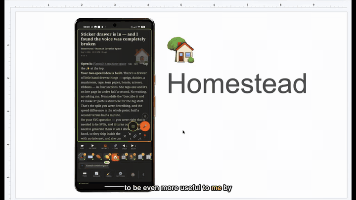
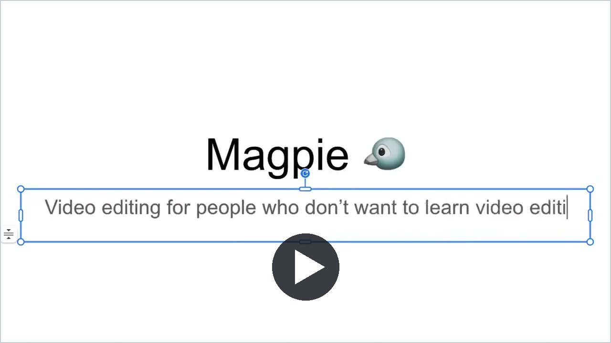
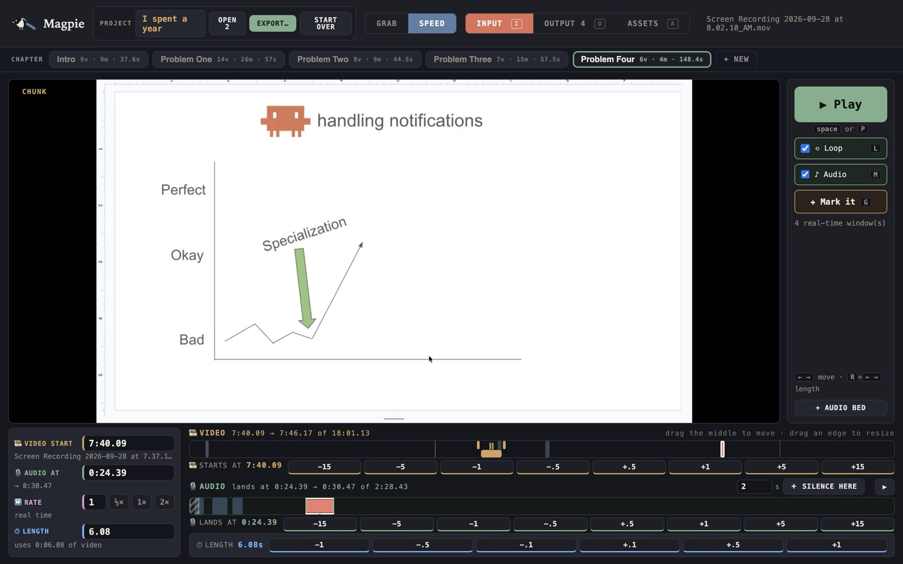

<h1 align="center">🐦 Magpie</h1>

<p align="center"><b>Video editing for people who don't want to learn video editing.</b></p>

<p align="center">
  
</p>

---

**Magpie is built for the ad hoc filmmaker.** You recorded your screen. You recorded yourself
talking over it. Now you need one short film where the right thing is on screen while you say
it, and you don't want to spend a weekend learning a real video editor to get there.

Honestly? Can't blame you. I didn't want to either. So I built this instead, and made
[the whole Homestead film](https://mullet.town/homestead/video) with it.

<p align="center">
  <a href="https://mullet.town/magpie#tutorial"></a><br>
  <b><a href="https://mullet.town/magpie#tutorial">▶ Watch the 2-minute tutorial</a></b>, made in Magpie.
</p>

## How it works

1. 🎙️ **Drop in your audio.** Your narration. That's the length of your film.
2. 🎬 **Drop in your videos.** Screen recordings, as long and rambling as they are.
3. 📍 **Mark the moments that matter.** The bits people should actually see at normal speed.
4. ⚡ **Magpie speeds up everything else** so the video lands exactly on your audio, no matter
   how much footage sits between your marks.
5. 📦 **Export.** One `.mp4`, straight to your Downloads.

<p align="center">
  
</p>

Also in the box: **chapters** (build a film in parts, export it as one), **split and trim**,
switch a clip **off** without deleting it, **captions** from a transcript, and **autosave**.

## 🤖 Don't just use it. Grow it with Claude Code.

This is the part that matters most. **Magpie is not meant to be used as-is.**

Magpie is the screen where *you* make the decisions: which moment, where it lands, how long it
plays. Everything else is meant to be added by you and [Claude Code](https://claude.com/claude-code)
the moment you need it. Every feature in here got built that way, mid-project, the minute it was
needed: splitting a clip, chapters, captions, switching a clip off.

So when Magpie doesn't do something you need:

```bash
cd magpie
claude
> "I want to be able to ___ in Magpie"
```

The code is plain Node and one HTML page, with no framework and no build step, and the comments
explain *why* every decision was made. That makes it easy for Claude Code to pick up and extend.

## Run it

You need **Node.js 18+** (developed on Node 22) and **ffmpeg** (with `ffprobe`) on your `PATH`.

```bash
# macOS:  brew install node ffmpeg
git clone https://github.com/joshua-mullet-town/magpie.git
cd magpie
npm start
```

Open **http://localhost:4021** and you're in. There are no npm packages to install. Everything
you add lives in `media/` next to the code; delete that folder to start fresh.

## Optional settings

| Variable | What it does |
|---|---|
| `PORT` | Port to serve on (default `4021`). |
| `HOST` | Address to listen on (default `127.0.0.1`). Use `0.0.0.0` to open it from other devices on your network. |
| `MAGPIE_WHISPER_URL` | A [whisper.cpp server](https://github.com/ggml-org/whisper.cpp/tree/master/examples/server) `/inference` URL for captions (default `http://localhost:8178/inference`). Everything else works without it. |
| `MAGPIE_INBOX` | A folder to watch. Any finished recording saved there is added to the open chapter automatically. |
| `MAGPIE_ON_EXPORT` | A script to run after every whole-film export, given the film's path (e.g. to upload it to your site). |

## Notes

- Built and used on macOS. It should run anywhere Node and ffmpeg do, but only macOS has been tested.
- It's a single-user tool for your own machine. There's no login, so don't expose it to the open internet.

## License

MIT. Take it, change it, make it yours. See [LICENSE](LICENSE).
